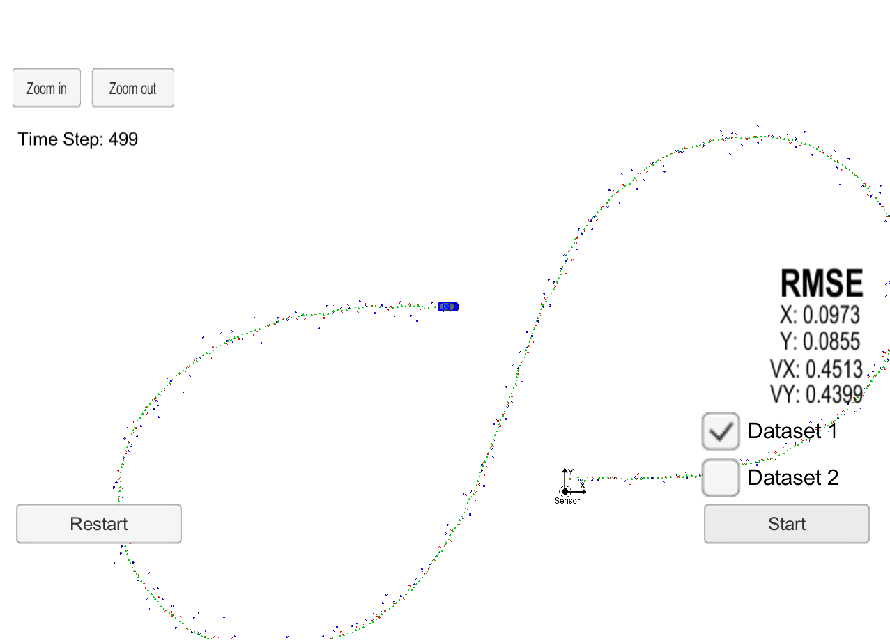

# Extended Kalman filter and sensor fusion

This project implements extended Kalman filter in C++ provided simulated lidar and radar measurements that detects a bicycle that travels around your vehicle. 
Lidar and radar measurements are fused to track the bicycle's position and velocity.

The project is composed by the following:

* main.cpp: It interfaces the project with [Udacity Term 2 simulator](https://github.com/udacity/self-driving-car-sim/releases)
* FusionEKF.cpp: It is a class that initializes bicycle states (x,y,x_dot,y_dot) given initial sensor measurement and compute state-space matrices and process and noise covariance matrices. It also creates an instance of an extended kalman filter (ekf) object.
* kalman_filter.cpp: It is a class that implements kalman filter equations for lidar (laser) measurements and extended kalman filter equations for radar measurements.
* Tools.cpp: It implements function such as CalculateRMSE() to evaluate filtering performance and CalculateJacobian() to linearize nonlinearities in the model.

The figure below illustrates the performance of the techniques implemented. The red dots are lidar measurements, blue dots are radar measurements and green dots are the estimated position of the bicycle.
